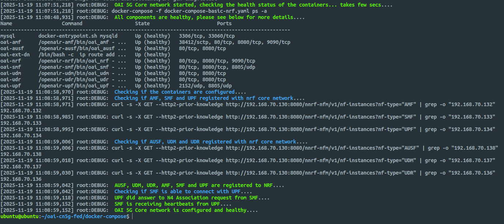

# OAI 5G Core Deployment Guide

**Environment:** Ubuntu 22.04

**Method:** Docker + OAI `oai-cn5g-fed` (v2.0.1)

## 1. System Preparation

Update the system and install required packages:

```bash
sudo apt update
sudo apt install -y git net-tools putty ca-certificates curl
```

## 2. Install Docker

### 2.1 Add Docker GPG Key and Repository

```bash
sudo install -m 0755 -d /etc/apt/keyrings
curl -fsSL https://download.docker.com/linux/ubuntu/gpg | sudo tee /etc/apt/keyrings/docker.asc > /dev/null
sudo chmod a+r /etc/apt/keyrings/docker.asc
echo "deb [arch=$(dpkg --print-architecture) signed-by=/etc/apt/keyrings/docker.asc] \
https://download.docker.com/linux/ubuntu $(. /etc/os-release && echo "$VERSION_CODENAME") stable" \
| sudo tee /etc/apt/sources.list.d/docker.list > /dev/null
```

### 2.2 Install Docker Components

```bash
sudo apt update
sudo apt install -y docker-ce docker-ce-cli containerd.io docker-buildx-plugin docker-compose-plugin docker-compose
sudo usermod -aG docker $(whoami)
```

Log out and back in to apply group changes or run `su - $USER` to start a new session.

## 3. Clone OAI 5G Core Repository

```bash
git clone https://gitlab.eurecom.fr/oai/cn5g/oai-cn5g-fed.git
cd oai-cn5g-fed/
git checkout v2.0.1
```

## 4. Sync Required Components

```bash
./scripts/syncComponents.sh
```

## 5. Enable IP Forwarding

```bash
sudo sysctl net.ipv4.conf.all.forwarding=1
sudo iptables -P FORWARD ACCEPT
```

## 6. Configuration Changes

Apply these changes for consistent user profile across database:

```patch
diff --git a/docker-compose/conf/basic_nrf_config.yaml b/docker-compose/conf/basic_nrf_config.yaml
index c55f7c9..acbf4d2 100644
--- a/docker-compose/conf/basic_nrf_config.yaml
+++ b/docker-compose/conf/basic_nrf_config.yaml
@@ -222,7 +222,7 @@ upf:
   support_features:
     enable_bpf_datapath: no    # If "on": BPF is used as datapath else simpleswitch is used, DEFAULT= off
     enable_snat: yes           # If "on": Source natting is done for UE, DEFAULT= off
-  remote_n6_gw: localhost      # Dummy host since simple-switch does not use N6 GW
+  remote_n6_gw: 127.0.0.1      # Dummy host since simple-switch does not use N6 GW
   smfs:
     - host: oai-smf            # To be used for PFCP association in case of no-NRF
   upf_info:
diff --git a/docker-compose/database/oai_db2.sql b/docker-compose/database/oai_db2.sql
index 35cb957..f854dc1 100755
--- a/docker-compose/database/oai_db2.sql
+++ b/docker-compose/database/oai_db2.sql
@@ -77,6 +77,7 @@ CREATE TABLE `AccessAndMobilitySubscriptionData` (
 ) ENGINE=InnoDB DEFAULT CHARSET=utf8;

 INSERT INTO `AccessAndMobilitySubscriptionData` (`ueid`, `servingPlmnid`, `nssai`) VALUES
+('208950000000031', '20895','{\"defaultSingleNssais\": [{\"sst\": 1, \"sd\": \"0xffffff\"}]}'),
 ('208950000000125', '20895','{\"defaultSingleNssais\": [{\"sst\": 1, \"sd\": \"1\"}]}'),
 ('208950000000126', '20895','{\"defaultSingleNssais\": [{\"sst\": 1, \"sd\": \"1\"}]}'),
 ('208950000000127', '20895','{\"defaultSingleNssais\": [{\"sst\": 1, \"sd\": \"1\"}]}'),
@@ -311,7 +312,7 @@ CREATE TABLE `SessionManagementSubscriptionData` (
 --

 INSERT INTO `SessionManagementSubscriptionData` (`ueid`, `servingPlmnid`, `singleNssai`, `dnnConfigurations`) VALUES
-('208950000000031', '20895', '{\"sst\": 222, \"sd\": \"123\"}','{\"default\":{\"pduSessionTypes\":{ \"defaultSessionType\": \"IPV4\"},\"sscModes\": {\"defaultSscMode\": \"SSC_MODE_1\"},\"5gQosProfile\": {\"5qi\": 6,\"arp\":{\"priorityLevel\": 1,\"preemptCap\": \"NOT_PREEMPT\",\"preemptVuln\":\"NOT_PREEMPTABLE\"},\"priorityLevel\":1},\"sessionAmbr\":{\"uplink\":\"100Mbps\", \"downlink\":\"100Mbps\"},\"staticIpAddress\":[{\"ipv4Addr\": \"12.1.1.4\"}]}}');
+('208950000000031', '20895', '{\"sst\": 1, \"sd\": \"0xffffff\"}','{\"oai\":{\"pduSessionTypes\":{ \"defaultSessionType\": \"IPV4\"},\"sscModes\": {\"defaultSscMode\": \"SSC_MODE_1\"},\"5gQosProfile\": {\"5qi\": 6,\"arp\":{\"priorityLevel\": 1,\"preemptCap\": \"NOT_PREEMPT\",\"preemptVuln\":\"NOT_PREEMPTABLE\"},\"priorityLevel\":1},\"sessionAmbr\":{\"uplink\":\"100Mbps\", \"downlink\":\"100Mbps\"},\"staticIpAddress\":[{\"ipv4Addr\": \"12.1.1.4\"}]}}');
 INSERT INTO `SessionManagementSubscriptionData` (`ueid`, `servingPlmnid`, `singleNssai`, `dnnConfigurations`) VALUES
 ('208950000000032', '20895', '{\"sst\": 222, \"sd\": \"123\"}','{\"default\":{\"pduSessionTypes\":{ \"defaultSessionType\": \"IPV4\"},\"sscModes\": {\"defaultSscMode\": \"SSC_MODE_1\"},\"5gQosProfile\": {\"5qi\": 6,\"arp\":{\"priorityLevel\": 1,\"preemptCap\": \"NOT_PREEMPT\",\"preemptVuln\":\"NOT_PREEMPTABLE\"},\"priorityLevel\":1},\"sessionAmbr\":{\"uplink\":\"100Mbps\", \"downlink\":\"100Mbps\"}}}');
 -- --------------------------------------------------------
```

Or simply apply the patch file:

```bash
git apply patch-files/oai-cn5g-fed.patch
```

## 7. Deploy the OAI 5G Core

Start the basic deployment (scenario 1):

```bash
cd docker-compose
python3 core-network.py --type start-basic --scenario 1
```




## Stopping the OAI 5G Core

```bash
python3 core-network.py --type stop-basic --scenario 1
```

> [!NOTE]
> Do not abruptly power off your VM. Sudden shutdowns can corrupt NRF registration state and cause inconsistent network-function discovery. Always stop the core properly before shutting down the machine.
